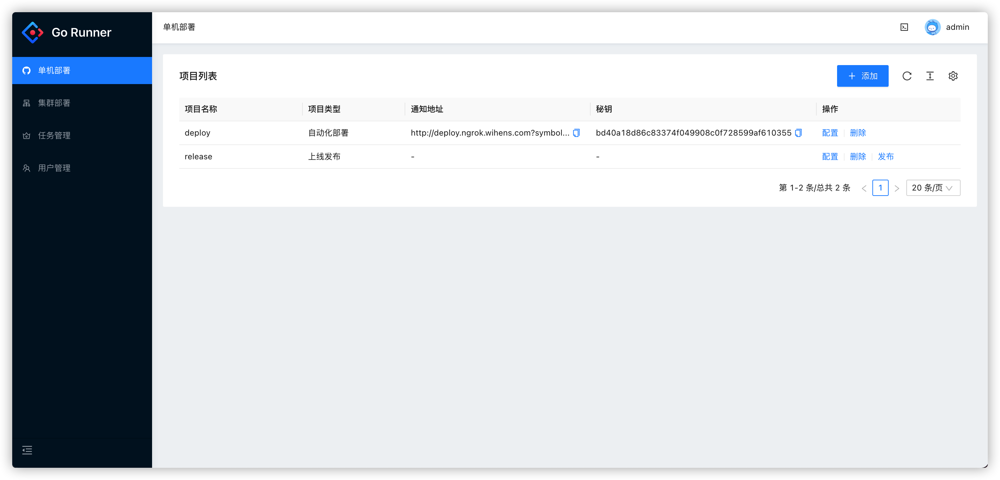
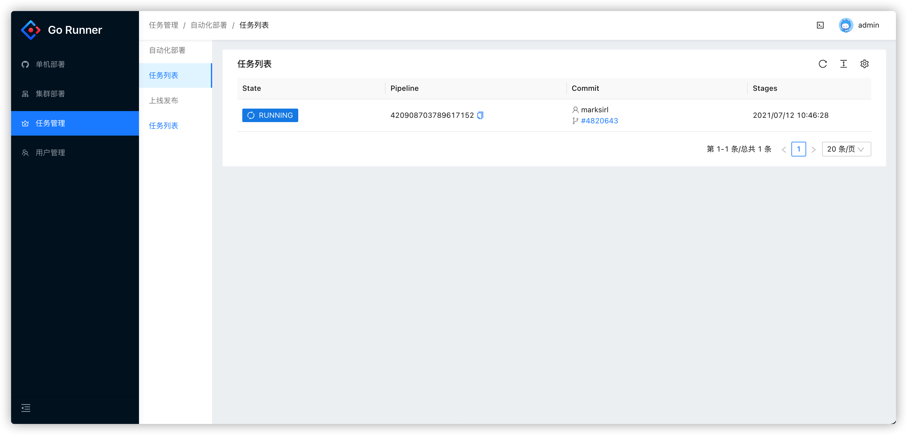
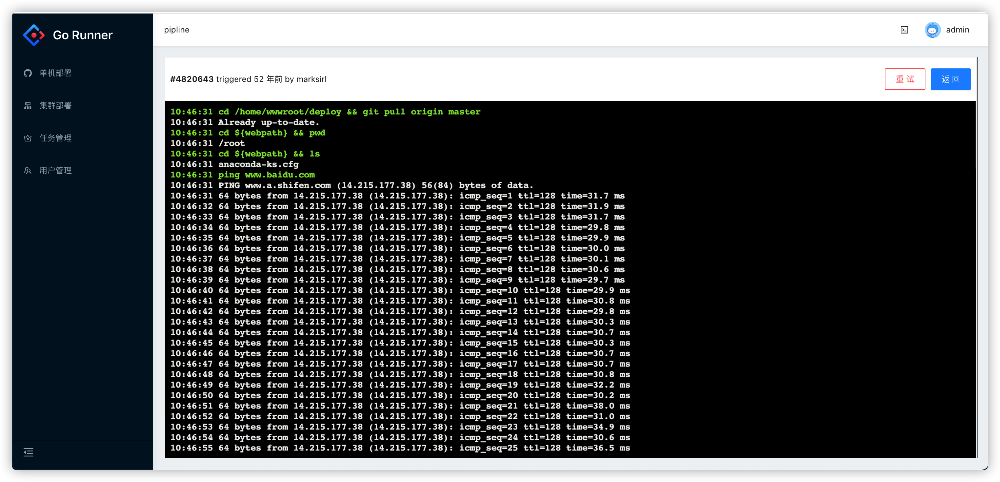

# Go Runner 轻量级部署

#### 项目介绍

Go Runner 是领先的开源自动化项目部署服务！支持各种web、php、java、python、go等代码的发布，所有操作可以通过web来一键完成。Go Runner 基于 go 构建安装简单，无需安装其他依赖环境，开箱即用。Go Runner 是一个可自由配置项目的开源上线部署系统。

> ```
> 如果对您有帮助，您可以点右上角 “Star” 收藏一下 ，获取第一时间更新，谢谢！
> ```

#### 下载

[下载运行包](https://gitee.com/marksirl/go-runner/releases)

#### 安装教程

[安装文档](https://doc.go-runner.wihens.com)

[Webhook配置教程](https://doc.go-runner.wihens.com/Deploy.html)

#### 特性

- 支持 gitlab、github、gitee仓库；
- 支持手动发布上线部署；
- 支持Test、Dev等多种环境webhook自动化部署，减少团队协作及开发成本；
- websocket 实时展示部署中的 shell console

#### 预览







#### 贡献

zrone \<xujining2008@126.com\>

