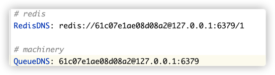

# Pave 自动化部署


##### 配置redis
etc/config.yaml


##### 配置nginx

```
upstream runner {
    server 0.0.0.0:8080 weight=1;
}

server {
    listen       80;
    server_name  go.runner.io; # 域名设置
    access_log   /usr/local/var/log/nginx/runner.log; # 日志目录
    error_log    /usr/local/var/log/nginx/runner.error.log; # 日志目录

    index index.html index.htm;

    add_header Access-Control-Allow-Origin *;
    add_header Access-Control-Allow-Methods 'GET, POST, OPTIONS, PUT, DELETE, PATCH';
    add_header Access-Control-Allow-Headers 'DNT,Keep-Alive,User-Agent,Cache-Control,Content-Type,Authorization,Access-Token';
    # cors
    if ($request_method = 'OPTIONS') {
        return 204;
    }

    # api
    location / {
        client_max_body_size       50m;
        client_body_buffer_size    128k;
        proxy_connect_timeout      300;
        proxy_send_timeout         300;
        proxy_read_timeout         300;
        proxy_buffer_size          4k;
        proxy_buffers              4 32k;
        proxy_busy_buffers_size    64k;
        proxy_temp_file_write_size 64k;

        # 将客户端的 Host 和 IP 信息一并转发到对应节点
        proxy_set_header Host $http_host;
        proxy_set_header X-Real-IP $remote_addr;
        proxy_set_header REMOTE-HOST $remote_addr;
        proxy_set_header HTTP-VIA $http_via;
        proxy_set_header X-Forwarded-For $proxy_add_x_forwarded_for;

        # 转发Cookie，设置 SameSite
        # proxy_cookie_path / "/; secure; HttpOnly; SameSite=strict";
        proxy_cookie_path / "/; HttpOnly; SameSite=Lax";

        # 执行代理访问真实服务器
        proxy_pass http://runner;
    }
    
    # websocket
    location /ws {
        proxy_set_header Upgrade "websocket";
        proxy_set_header Connection "upgrade";
        proxy_set_header X-Forwarded-For $proxy_add_x_forwarded_for;
        proxy_set_header Host $host;
        proxy_http_version 1.1;

        # 转发到多个 ws server
        proxy_pass http://runner;
    }
}
```

##### 启动服务
go run runner.go 或 ./runner

##### 访问web目录
go.runner.io/web
web默认用户
- admin
- 123456

##### 配置项目


##### 说明
1. etc/config.yaml
   
   | 参数     | 说明                                  |
   | -------- | ------------------------------------- |
   | Host     | 主机HOST，默认 127.0.0.1              |
   | Port     | 默认启动端口, 默认 8080               |
   | Domain   | webhook  通知地址，自动化部署需要配置 |
   | RedisDNS | redis配置                             |
   | QueueDNS | redis配置                             |
   
2. 配置git sshkey
3. 部署脚本名称固定 .runner-ci.yml，格式参考项目文件
